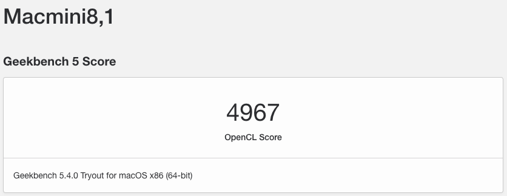
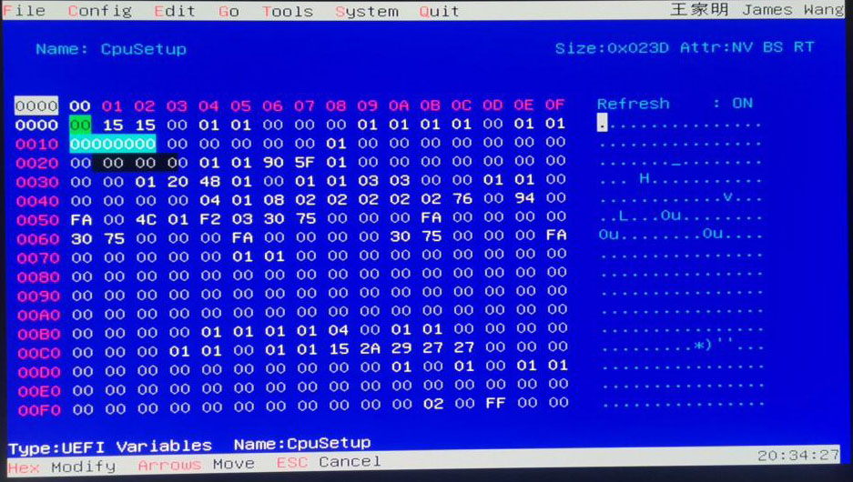

  

# Intel NUC10i5FNH Hackintosh :sunglasses:

EFI for Intel NUC10i5FNH with OpenCore 0.6.7 bootloader

## OS Version

macOS Big Sur 11.2.3

## Attention ## 

Please generate SMBios and add to conflig.plist (Using https://github.com/corpnewt/GenSMBIOS)

### INFO PC:

| Component        | Brank                                  |
| ---------------- | ---------------------------------------|
| CPU              | Intel® Core™ i5-10210U                 |
| iGPU             | Intel® UHD Graphics 630                |
| Audio            | Realtek ALC256                         |
| RAM              | 16 GB DDR4 2400 Mhz                    |
| WiFi + Bluetooth | INTEL Wi-Fi 6 AX201 + Bluetooth 5.0    |
| LAN              | Intel I219V10                          |
| Thunderbolt 3    | JHL7540 Thunderbolt 3                  |
| NVMe             | Kingstone A2000 M.2 2280 NVME (MacOS)  |
| SMBios           | Macmini8,1                             |
| BootLoader       | OpenCore 0.6.7                         |
| macOS            | Big Sur 11.2.3                         |

See the [IOREG](https://github.com/pierpaolodimarzo/Intel-NUC10i5FNH/blob/main/Mac%20mini.ioreg)

### What works and What doesn't or WIP:

- [x] CFG Unlock
- [x] Intel Graphics UHD iGPU HDMI Output
- [x] ALC256 Internal Speakers
- [x] ALC256 HDMI/Thunderbolt Audio Output
- [x] All USB Ports (3.0/3.1)
- [x] Sleep / Wake / SpeedStep 
- [x] AC 9560 Wi-Fi and Bluetooth
- [x] Controller NVME PciE Gen3x4 
- [x] NVRAM
- [x] microSDXC Card Reader
- [x] Thunderbolt 3 GC Titan Ridge V2
- [x] Thunderbolt Hotplug for GC Titan Ridge
- [x] USB C Hotplug For GC Titan Ridge

## Peripherals & Benchmarks

This is the speed test of [Kingstone A2000 - SSD NVMe PCIe](https://www.kingston.com/italy/it/ssd/a2000-nvme-pcie-ssd)

This is the speed test of RAM [Crucial 8GB x2 DDR4 2400](https://it.crucial.com/memory/ddr4/ct2k8g4sfs824a)

This is the speed test of Thunderbolt 3 - SSD 970 EVO Plus

## BIOS config

To start, choose "Load Defaults" (choose from the menu or press F2 in the BIOS setup).

BIOS version FNCML357.0050 (latest)

* ## Advanced
* ATA Mode Selection -> AHCI
* ## Video
* IGD Minimum Memory -> 64MB
* IGD Aperture Size -> 256MB
* IGD Primary Video Port -> Auto
* ## Boot
* Secure Boot -> Disabled
* UEFI Boot -> Checked
* Legacy Boot -> Unchecked
* Fast Boot -> Unchecked
* ## Power
* Secondary Power Settings
* Deep S4/S5 -> Off
* Wake on Lan from S4/S5 -> Stay Off
* Wake System from S5 -> Off
* Wake From Thunderbolt Device -> Off

## CFG Unlock 

N.B. this procedure is very risky.
Any responsibility for this function is discharged to those who perform it.
Be very careful when making this change.

Let's start by downloading the file [RU.efi](./CFGunlock/RU.efi)

We format the USB in FAT32 format.
We copy the RU.efi file in the USB Root.
We enable the UEFI Shell parameter from the BIOS.
We attach the USB stick to the PC and start the UEFI Shell by pressing F10.

If everything is correct, we will come to this screen:

We will then have to find our ROOT, which in my case is FS1
So now we will write "fs1:"
Then we will write "ls"

We will find ourselves in this situation at this point:

Then type RU.efi and this mask will appear.

Press ALT + ì to remove the popup on the screen.
At this point, on the keyboard, press PagDOWN to scroll the list.

We need to get to the "CPUSetup"

And click ENTER to access the section.

Now we have to go down to the value "0030 - 0E

Now let's change the value 01 to 00

The correct version will be the following:

Now to save we press CTRL + W

If everything went well, we will have this screen with a red popup

Ejoy

## Credits

- [Apple](https://apple.com) for macOS.
- [Acidanthera](https://github.com/acidanthera) for OpenCore and all the lovely hackintosh work.
- [Dortania](https://dortania.github.io/OpenCore-Install-Guide/config-laptop.plist/icelake.html) For great and detailed guides.
- [Hackintoshlifeit](https://github.com/Hackintoshlifeit) Support group for installation and post installation.
- [MBarbierato](https://github.com/mbarbierato) for the valuable support for installation and post installation, and for the fix of the SD Card Reader, and other.
- [basett1](https://github.com/basett1/) for the support and for the cfg lock tools and info.
- [Lorys89](https://github.com/Lorys89) for the support of settings of UHD Graphics.

# If you need help please contact us on [Telegram](https://t.me/HackintoshLife_it) or [Web](https://www.hackintoshlife.it/).
